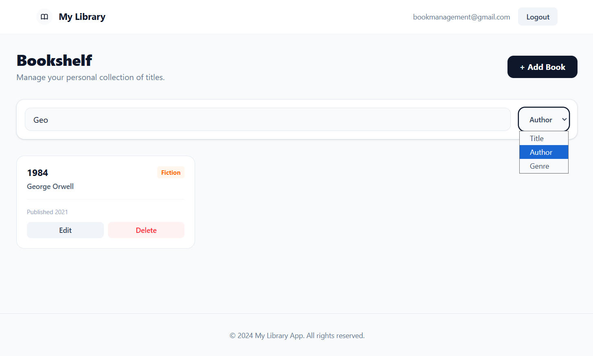

# 📚 My Library — Personal Book Management App

A full-stack personal library application where users can manage their own book collections. Each user sees only their own books after secure login. Book details like description, genre, and publication year are automatically fetched from the Google Books API.

---

## 🖼️ Screenshots

### Login


### Empty Shelf


### My Library


### Add Book


### Book Details


### Search


---

## ✨ Features

- 🔐 Secure authentication with Auth0 (OAuth2 / JWT)
- 👤 Multi-user support — each user manages their own private collection
- ➕ Add books with title and author — details are auto-filled via Google Books API
- 📖 View book details: description, genre, and publication year
- ✏️ Edit and delete books
- 🔍 Search books by title, author, or genre
- 📱 Responsive and clean UI built with Tailwind CSS

---

## 🛠️ Tech Stack

### Backend
| Technology | Purpose |
|---|---|
| Java 17 | Programming language |
| Spring Boot 3 | Backend framework |
| Spring Security + OAuth2 | JWT-based authentication |
| Spring Data JPA | Database access |
| H2 Database | In-memory database |
| Auth0 | Identity provider |
| Google Books API | Auto-fetch book details |

### Frontend
| Technology | Purpose |
|---|---|
| React 18 | UI framework |
| Vite | Build tool |
| Auth0 React SDK | Authentication |
| Axios | HTTP client |
| React Router | Client-side routing |
| Tailwind CSS | Styling |

---

## 🔌 External APIs

### 🔑 Auth0
Used for user authentication and authorization. Every user logs in via Auth0 and receives a JWT access token. The backend validates this token on every request, ensuring each user can only access their own data.

- [auth0.com](https://auth0.com) — Free tier available

### 📚 Google Books API
When a book is added, the backend automatically queries the Google Books API using the title and author. It fetches and stores:
- **Description** — summary of the book
- **Genre** — category (e.g. Fiction, Science)
- **Published Year** — year of first publication

- [developers.google.com/books](https://developers.google.com/books) — Free tier available

---

## 🚀 Getting Started

### Prerequisites
- Java 17+
- Node.js 18+
- An [Auth0](https://auth0.com) account
- A [Google Cloud](https://console.cloud.google.com) account with Books API enabled

---

### Backend Setup

1. Clone the repository:
```bash
git clone https://github.com/hemreozdes/BookManagement.git
cd BookManagement/book-management
```

2. Create your `application.properties` file by copying the example:
```bash
cp src/main/resources/application.properties.example src/main/resources/application.properties
```

3. Fill in your own values in `application.properties`:
```properties
spring.security.oauth2.resourceserver.jwt.issuer-uri=https://YOUR_AUTH0_DOMAIN.us.auth0.com/
spring.security.oauth2.resourceserver.jwt.audiences=YOUR_API_IDENTIFIER
google.books.api.key=YOUR_GOOGLE_BOOKS_API_KEY
```

4. Run the backend:
```bash
./mvnw spring-boot:run
```

Backend runs on `http://localhost:8080`

---

### Frontend Setup

1. Navigate to the frontend folder:
```bash
cd BookManagement/book-management-frontend
```

2. Install dependencies:
```bash
npm install
```

3. Create your `.env` file by copying the example:
```bash
cp .env.example .env
```

4. Fill in your own values in `.env`:
```
VITE_AUTH0_DOMAIN=YOUR_AUTH0_DOMAIN
VITE_AUTH0_CLIENT_ID=YOUR_AUTH0_CLIENT_ID
VITE_AUTH0_AUDIENCE=YOUR_API_IDENTIFIER
```

5. Run the frontend:
```bash
npm run dev
```

Frontend runs on `http://localhost:5173`

---

### Auth0 Configuration

In your Auth0 dashboard:
- Create a **Single Page Application** for the frontend
- Create an **API** with the identifier you used as audience
- Set Allowed Callback URLs: `http://localhost:5173`
- Set Allowed Logout URLs: `http://localhost:5173`
- Set Allowed Web Origins: `http://localhost:5173`
- Add a **Post Login Action** to include email and name in the access token:

```javascript
exports.onExecutePostLogin = async (event, api) => {
  const namespace = 'https://book-management-api/';
  api.accessToken.setCustomClaim(namespace + 'email', event.user.email);
  api.accessToken.setCustomClaim(namespace + 'name', event.user.name);
};
```

---

## 📁 Project Structure

```
BookManagement/
├── book-management/          # Spring Boot backend
│   └── src/main/java/
│       └── com/hemreozdes/book_management/
│           ├── controllers/
│           ├── services/
│           ├── entities/
│           ├── dtos/
│           ├── repos/
│           └── security/
├── book-management-frontend/ # React frontend
│   └── src/
│       ├── components/
│       ├── pages/
│       └── services/
└── screenshots/
```

---

## 👤 Author

**Hamit Emre Özdeş**  
[github.com/hemreozdes](https://github.com/hemreozdes)
